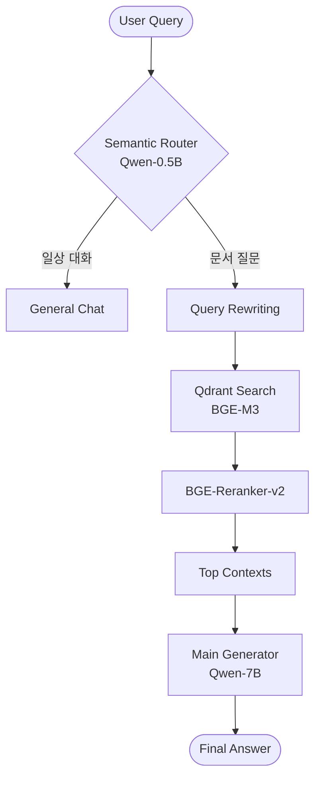

# 고성능 Multi-LLM RAG 엔진 개발 계획 (Portfolio Grade)

본 프로젝트는 LangChain을 활용하여, 로컬 환경에서 구동 가능한 Multi-LLM RAG 서비스 프로토타입을 구축하는 것을 목표로 합니다.

## 1. 기술 스택 (Tech Stack)
- **LLM Serving:** vLLM (OpenAI Compatible API) 또는 FastAPI Custom Wrapper
- **Models:** Qwen2.5-0.5B (Router/Refiner), Qwen2.5-7B (Generator)
- **Document Parsing:** Docling (IBM의 고성능 문서 파싱 엔진)
- **Embedding:** BGE-M3 (Multi-lingual, Multi-vector 지원)
- **Vector DB:** Qdrant (High-performance Vector Search Engine)
- **Reranker:** BGE-Reranker-v2-m3
- **Framework:** LangChain (LCEL 기반 오케스트레이션)

## 2. 개발 단계별 체크리스트

### Phase 1: 인프라 및 환경 구축
- [x] **Docker Compose 기반 인프라 설정:** Qdrant 가동 (`docker-compose.yml` 생성됨)
- [x] **LLM API 서비스 구축 (vLLM Docker 기반):**
  - [x] LLM 1: vllm-router (Port 8001) - GPU 1 사용 (Semantic Router용)
  - [x] LLM 2: vllm-main (Port 8002) - GPU 0 사용 (Main Generator용)
- [x] **Python 가상환경 및 의존성 설치:** (`requirements.txt` 및 `typing as tp` 리팩토링 완료)

### Phase 2: 고성능 데이터 인제스천 (Ingestion)
- [x] **Docling 파이프라인:** PDF/Docx 내 표(Table), 계층 구조 추출 로직 구현 완료
- [x] **Hybrid Chunking:** 마크다운 구조 기반의 Recursive Character Splitting 적용 완료
- [x] **BGE-M3 Embedding:** 문서 벡터화 및 Qdrant 저장 (172.17.0.1 기반 연동 완료)

### Phase 3: 지능형 검색 및 분석 파이프라인 (Retrieval)
- [x] **Semantic Router (Qwen-0.5B):**
  - [x] **의도 분류 (Intent Classification):** 사용자 쿼리 분류 로직 구현 및 테스트 완료
  - [x] **Fast-path/Slow-path 설계:** 단순 대화 즉시 응답 경로 설계 완료
- [x] **Query Rewriting (Qwen-0.5B):**
  - [x] **De-contextualization:** 검색 쿼리 최적화 로직 구현 완료
  - [x] **Search Optimization:** 자연어 쿼리를 키워드 중심의 검색용 쿼리로 변환 로직 구현 및 테스트 완료
- [x] **Hybrid Retrieval (BGE-M3):**
  - [x] Dense Vector(유사도) 검색 수행 및 Qdrant 연동 완료
- [x] **Reranking (BGE-Reranker-v2):**
  - [x] BGE-Reranker-v2-m3를 이용한 검색 결과 정밀 재정렬 로직 구현 완료

### Phase 4: LangChain 오케스트레이션 및 API
- [x] **LCEL(LangChain Expression Language) 기반 체인 설계:**
  - [x] Router -> (Retriever -> Reranker) -> Generator 전체 파이프라인 통합 및 테스트 완료
- [ ] **FastAPI 스트리밍 서버:** 응답 지연 시간(Latency) 최소화를 위한 Stream 지원
- [x] **Prompt Engineering:** 각 역할별(Router, Refiner, Generator) 페르소나 및 Few-shot 최적화 완료

### Phase 5: 검증 및 시각화
- [ ] **RAGAS 기반 평가:** 검색 정확도(Faithfulness), 답변 관련성(Relevancy) 측정
- [ ] **Portofolio용 문서화:** 성능 지표(Latency, Accuracy) 및 아키텍처 다이어그램 정리

---

## 아키텍처 (Advanced RAG Workflow)

